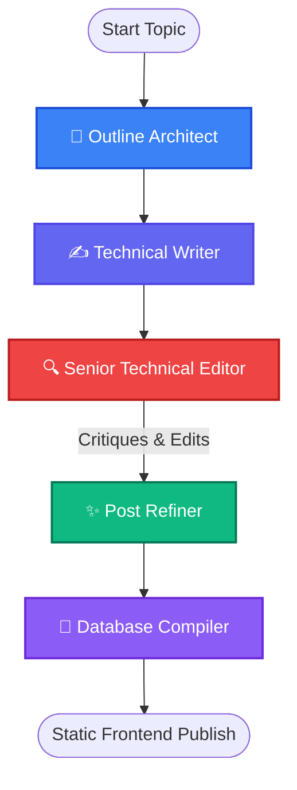

# 📋 BlogBoard — Autonomous AI Technical Blog Platform

<p align="center">
  
  
  
</p>

---

BlogBoard is a fully autonomous technical writing and publication ecosystem. It schedules, researches, outlines, drafts, critiques, refines, and publishes production-grade, zero-fluff engineering articles on Machine Learning and Artificial Intelligence directly to a fast, static web dashboard.

---

## 🧠 The Multi-Agent Editorial Workflow

Instead of simple one-shot LLM generations, BlogBoard implements a **Stateful Multi-Agent System** using **LangGraph** to emulate a real-world publishing house editorial pipeline:



### 1. 📝 Outline Architect
Deconstructs the user-provided topic into a comprehensive, highly technical roadmap covering background, code implementations, and mathematical justifications.

### 2. ✍️ Technical Writer
Fleshes out the outline into a deep-dive markdown article loaded with practical examples, clear explanations, and syntax-highlighted code.

### 3. 🔍 Senior Technical Editor (Critique Agent)
Simulates a rigorous editor reviewing the draft. It actively searches for logical gaps, formatting errors, or superficial explanations, generating a structured critique list.

### 4. ✨ Post Refiner
Acts as the writer revising the draft. It carefully incorporates all points raised in the editor's critique to yield a highly polished, production-grade output.

### 5. 💾 Database Compiler
Calculates the article's reading time, generates relevant tags, formats frontmatter, saves the markdown file, and compiles it into the `manifest.json` metadata index.

---

## ⚡ Key Features

* **Robust Rate-Limit Recovery**: Embedded node-cooldown logic respects Groq's TPM limits, ensuring stable generation pipelines.
* **Serverless Manifest Architecture**: Dynamically updates `manifest.json`, letting the static site operate fully dynamically without databases or servers.
* **Modern CSS Design**: Styled with vibrant HSL dark colors, subtle backglow animations, and premium glassmorphic navigation cards.
* **Interactive Dashboard**: Static client loads, indexes, and filters articles by tag or search-as-you-type inputs dynamically.

---

## 📁 Repository Structure

```text
BlogBoard/
├── backend/
│   ├── graph.py           # LangGraph Workflow & Nodes
│   ├── llm.py             # Groq Client Initialization
│   ├── run.py             # Non-Interactive CLI Executor
│   └── requirements.txt   # Python Dependencies
├── frontend/
│   ├── index.html         # Premium Client UI
│   ├── styles.css         # Glassmorphism Styling
│   ├── app.js             # Dynamic Loading, Filtering & Search
│   └── posts/
│       ├── manifest.json  # Auto-generated index of all posts
│       └── *.md           # Generated markdown files
└── .gitignore
```

---

## 🚀 Getting Started

### 1. Clone & Set Up Directory
```bash
git clone https://github.com/Shreya71703/BlogBoard-AI-Blog-Generator.git
cd BlogBoard-AI-Blog-Generator
```

### 2. Install Dependencies
```bash
python -m venv .venv
# On Windows:
.venv\Scripts\activate
# On Linux/Mac:
source .venv/bin/activate

pip install -r backend/requirements.txt
```

### 3. Configure API Key
Create a `.env` file in the root directory:
```env
GROQ_API_KEY=your_groq_api_key_here
```

### 4. Run the Pipeline
Generate a new deep-dive article using:
```bash
python backend/run.py
```

### 5. Launch the Dashboard
Serve the website locally and open it:
```bash
python -m http.server 8000 --directory frontend
```

---

## 📄 License
Licensed under the **MIT License**. See `LICENSE` for more information.
